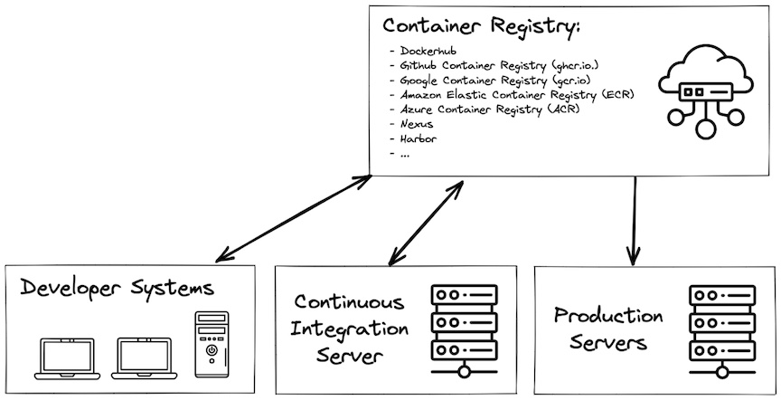
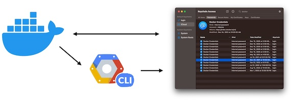

# Container Registries

A container registry is a repository, or collection of repositories, used to store and access container images. They serve as a place to store and share container images between developer systems, continuous integration servers, and deployment environments.

Examples of popular container registries include:

- [Dockerhub](https://hub.docker.com)
- [Github Container Registry (ghcr.io.)](https://docs.github.com/en/packages/working-with-a-github-packages-registry/working-with-the-container-registry)
- [Gitlab Container Registry](https://docs.gitlab.com/ee/user/packages/container_registry/)
- [Google Container Registry (gcr.io)](https://cloud.google.com/container-registry)
- [Amazon Elastic Container Registry (ECR)](https://aws.amazon.com/ecr/)
- [Azure Container Registry (ACR)](https://azure.microsoft.com/en-us/products/container-registry)
- [jFrog Container Registry](https://jfrog.com/container-registry/)
- [Nexus](https://blog.sonatype.com/nexus-as-a-container-registry)
- [Harbor](https://goharbor.io/)

## Authenticating to Container Registries

While you can pull many public images from registries without authenticating, in order to push images to a registry, or pull a private image, you will need to authentic

Docker can login directly to some registries with basic authentication (username/password) or call out to separate programs known as credential helpers. For example, to authenticate to the Google Container Registry, docker uses the `gcloud` command line utility from GCP (https://cloud.google.com/container-registry/docs/advanced-authentication#gcloud-helper). 

If available, Docker can also store the credentials in a secure store (`macOS keychain`, `Windows Credential Manager`) to help protect those credentials.

